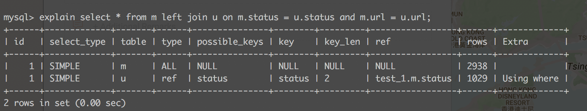
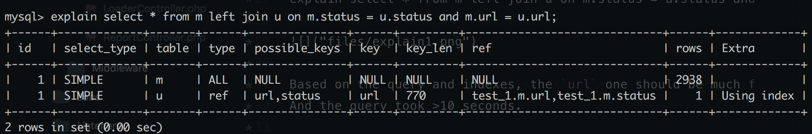

## Different charsets on varchar affect join performance?

#### Mysql version: 5.5.5

#### Two tables `m(utf8)` and `u(latin1)`. 
-  table `m` has 3,000 records. `u` has 200,000 records
- `status` is smallint(5), `url` is a varchar(255)

```mysql
CREATE TABLE `m` (
  `status` smallint(5) unsigned NOT NULL,
  `url` varchar(255) NOT NULL
) ENGINE=InnoDB DEFAULT CHARSET=utf8
```

```mysql
CREATE TABLE `u` (
  `status` smallint(5) unsigned NOT NULL,
  `url` varchar(255) DEFAULT NOT NULL,
  UNIQUE KEY `url` (`url`,`status`),
  KEY `status` (`status`)
) ENGINE=InnoDB DEFAULT CHARSET=utf8
```
#### Query:

```mysql
explain select * from m left join u on m.status = u.status and m.url = u.url;
```


Based on the query and indexes, the `url` one should be much faster. But Mysql choose to use `status`.
And the query took >12 seconds.


If we change the charset of `u` to `utf8`(Both tables are utf8):
```mysql
ALTER TABLE u CONVERT TO CHARACTER SET utf8;
```
And try the same query:



Now it uses `url` and spend much less time:


#### Conclusion:

It seems in some circumstances different charsets of varchar will affect mysql to choose the right index. Which might cause the performance issue.

